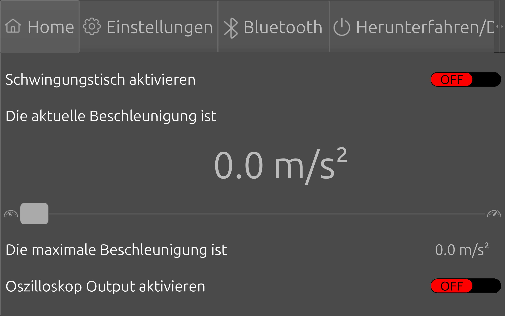
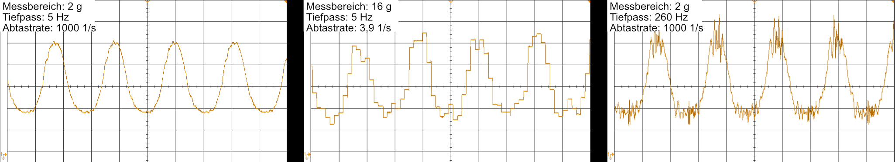
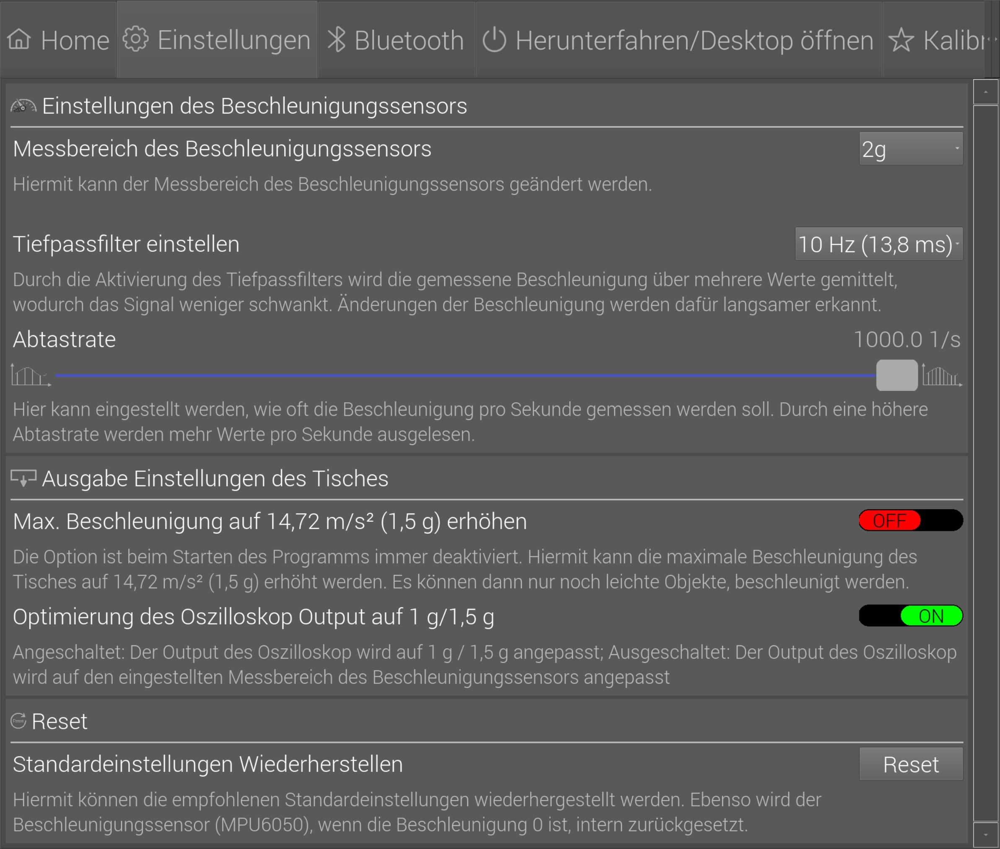
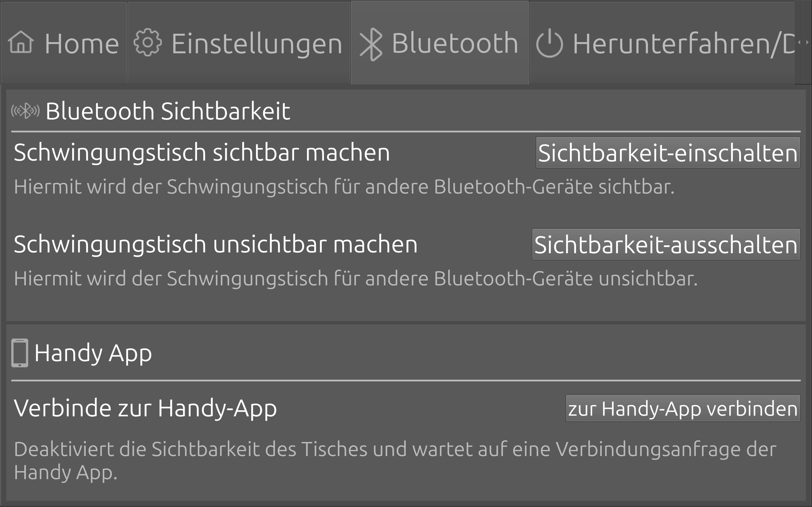
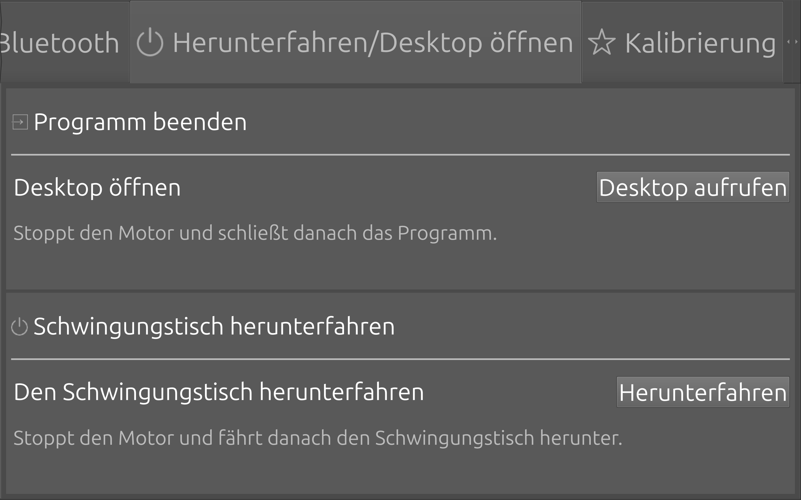
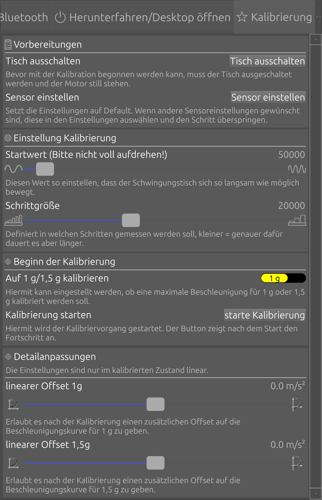
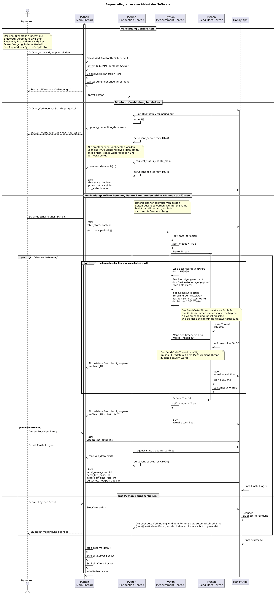
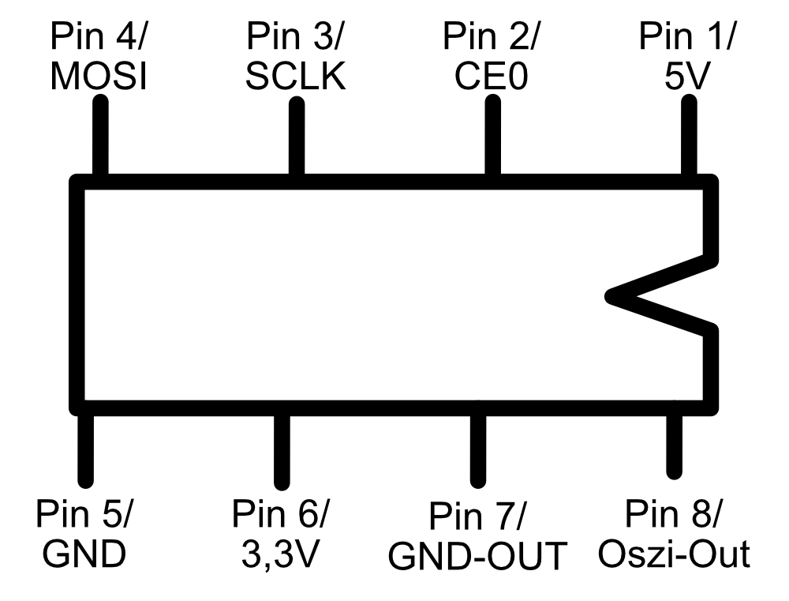

# Projektarbeit: Software für einen Schwingungstisch

In dieser Projektarbeit wurde die Software für einen Schwingungstisch entwickelt. Parallel hat ein Teamkollege die Hardware davon aufgebaut. Zusammen mit einem makroskopischen Beschleunigungssensor aus einer vorangegangenen Projektarbeit kann damit z.B. am Campus Tag oder in Laborvorführungen demonstriert werden, wie ein Beschleunigungssensor funktioniert. Im folgenden Video ist das Endergebnis als Animation dargestellt. Danach wird kurz zusammengefasst was die Software kann und im Anschluss wird die GUI beschrieben. Darauffolgend wird die Funktion einiger Komponenten genauer erklärt: Ablauf der automatischen Kalibration und die Funktionsweise des Emulators. Der Ablauf der wichtigsten Prozesse der Software ist zudem als Sequenzdiagramm dargestellt. Abschließend ist die Pinbelegung am Raspberry Pi aufgelistet.

https://github.com/user-attachments/assets/6986a7ba-e4c2-4e37-9cde-6720ba19b400

*Video: Animation des Schwingungstisches mit makroskopischen Schwingungstisch. Die Animation wurde mit <a href="https://www.blender.org/">Blender</a> erstellt.*

## Kurzbeschreibung
Der Schwingungstisch kann Objekte bis 5 kg auf ±1 g und leichtere Objekte auf ±1,5 g beschleunigen. Die Software steuert hierbei den Motor über eine PWM (Pulsweiten-Modulation) an und erlaubt das Anpassen der aktuellen maximalen Beschleunigung des Schwingungstisches, sowie der Anzeige von dieser. Damit die gewünschte Beschleunigung eingestellt werden kann, gibt es die Möglichkeit eine automatische Kalibrierung zu starten. Um die aktuelle Beschleunigung zu messen, wird ein kommerzieller Beschleunigungssensor (MPU6050) verwendet. Durch das Auswählen verschiedener Messeinstellungen des Beschleunigungssensors (Messbereich, Tiefpassfilter & Abtastrate einstellen) kann die Bedeutung der korrekten Messeinstellungen praktisch gezeigt werden. Dies funktioniert am Besten mit dem Oszilloskopausgang des Schwingungstisches der mit einem Digital-Analog-Wandler (MCP4921) realisiert wird. Abschließend kann der Tisch auch über eine Handy App per Bluetooth gesteuert werden. Zudem kann die Software mit Hilfe der Dateien im Ordner "Emulator" auch ohne vorhandene Hardware ausgeführt und weiterentwickelt werden.

## Überblick über die UI
### Die Startseite
Auf dieser Seite kann der Schwingungstisch ein- und ausgeschaltet werden. Ebenso wird die aktuell gemessene maximale Beschleunigung betragsmäßig angezeigt. Diese kann sowohl über den Slider als auch über einen externen Inkrementgeber geändert werden. Die Änderung der Beschleunigung wird dabei nicht sofort an den Motor weitergegeben, sondern schrittweise erhöht, um die Hardware zu schonen. Auf der Startseite kann zudem der Oszilloskop-Ausgang an- & ausgeschaltet werden. Der Oszilloskopausgang erlaubt es die gemessene Beschleunigung des Beschleunigungssensors (MPU6050) auf einem Oszilloskop zu visualisieren.



*Abbildung: Screenshot der Startseite*

### Die Einstellungen
Im ersten Abschnitt der Seite können die Einstellungen der Beschleunigungsmessung (Messbereich ändern, verschiedene Tiefpassfilter einstellen, Abtastrate) geändert werden. Damit kann demonstriert werden, wie die Wahl der richtigen Messeinstellungen das Messergebnis maßgeblich verbessern kann, was die Messdatenauswertung in realen Produkten vereinfachen und verbessern kann. Im folgenden Bild ist dies quantitativ für verschiedene Messeinstellungen gezeigt. Der Tisch hatte dabei jeweils dieselbe Beschleunigung eingestellt.</br>



*Abbildung: Die Oszilloskopausgabe bei verschiedenen Einstellungen des Beschleunigungssensors*

Unter den Einstellungen gibt es die Möglichkeit, die maximal einstellbare Beschleunigung von ±1 g auf ±1,5 g zu erhöhen. Die manuelle Aktivierung der Einstellung ist nötig, da die Hardware den makroskopischen Beschleunigungssensor (Gewicht: 5 kg) nicht auf ±1,5 g beschleunigen kann, die ±1,5 g aber für leichtere Objekte ermöglicht werden soll.</br>
Die Einstellung zur Optimierung des Oszilloskop-Outputs ändert die Skalierung von diesem. Hierbei können maximal zwischen 0 V bis 3,3 V ausgegeben werden. Ist die Einstellung aktiviert, ist 0 V bei -1 g/-1,5 g und 3,3 V bei 1 g/1,5 g, abhängig von der Einstellung der maximalen Beschleunigung. Ist die Einstellung deaktiviert, sind die 0 V das Minimum des eingestellten Messbereichs -2 g/-4 g/-8 g/-16 g und die 3,3 V das Maximum 2 g/4 g/8 g/16 g, abhängig vom eingestellten Messbereich des Beschleunigungssensors. Diese Einstellung zeigt den Effekt, wenn der Messbereich des Schwingungstisches geändert wird. Im letzten Abschnitt der Seite können die oben gezeigten Einstellungen auf die empfohlenen Optionen zurückgesetzt werden.



*Abbildung: Screenshot der Einstellungsseite*

### Die Bluetooth-Seite
Hier kann die Bluetooth-Sichtbarkeit des Schwingungstisches an- und ausgeschaltet werden. Im Abschnitt der Handy App kann die Verbindung zur Handy App hergestellt werden. Ebenfalls wird hier der aktuelle Verbindungsstand zur App ausgegeben. Im Abschnitt UML-Diagramm ist zudem ein Sequenzdiagramm gezeigt, welches unter anderem den Ablauf der Kommunikation zwischen der App und dem Tisch, visualisiert.


*Abbildung: Screenshot der Bluetoothseite*

### Die Herunterfahren/Desktop öffnen Seite
Um den Raspberry Pi warten zu können, kann hier bei Bedarf der Desktop von diesem aufgerufen werden. Ebenfalls kann der Schwingungstisch hier heruntergefahren werden. 


*Abbildung: Screenshot der Bluetoothseite*

### Die Kalibrierungsseite
Damit die auf der Startseite vorgegebene Beschleunigung mit der realen Beschleunigung übereinstimmt, muss der Tisch kalibriert werden. Um den Vorgang möglichst komfortabel durchzuführen, wurde der Vorgang automatisiert. Vor dem Start der Kalibrierung muss der Nutzer Vorbereitungen treffen. Hierzu empfiehlt es sich die Seite von oben nach unten durchzugehen. Im Bereich Vorbereitungen wird empfohlen einfach die zwei Knöpfe nacheinander zu drücken um die idealen Startbedingungen zu bekommen. Bei der Einstellung für den Startwert muss die PWM-Frequenz ausgewählt werden, bei der der Tisch gerade so anfängt zu schwingen (Motor wird beim wählen der Einstellung automatisch gestartet), welches dann der Beginn der Kalibrierung ist. <b>Wichtig: Ein zu großer Wert für den Startwert kann dazu führen, dass der Tisch außerhalb des vorgegebenen Bereichs betrieben wird (der Tisch schwingt schneller als normal). Dies ist nicht notwendig und sollte vermieden werden.</b></br>

Die Schrittgröße gibt an, in welchen Abständen die PWM-Frequenz bei der Kalibration erhöht werden soll. Im Abschnitt Beginn der Kalibrierung kann angegeben werden, bis zu welcher Beschleunigung (1 g/1,5 g) kalibriert werden soll. Die Ergebnisse werden dabei getrennt abgespeichert. Durch drücken auf "starte Kalibrierung" wird der Kalibrierungsvorgang gestartet, der Fortschritt wird zudem ausgegeben. Danach ist die Kalibrierung abgeschlossen. Im Abschnitt Detailanpassungen kann bei Bedarf ein linearer Offset auf die Kurve gerechnet werden. Hinweis: Der Offset ist nur linear, wenn der Tisch kalibriert ist. Die Einstellungen für den Offset können dabei zu jedem Zeitpunkt angepasst werden.



*Abbildung: Screenshot der Kalibrierungsseite*

Von technischer Seite funktioniert die Kalibrierung wie folgt: 
<ol>
  <li>Nutzer stellt den Tisch so ein, dass dieser sich gerade so bewegt.</li>
  <li>Schrittweise Erhöhung der PWM-Frequenz mit vom Nutzer definierter Schrittgröße</li>
  <li>Warte nach der Erhöhung der PWM-Frequenz kurz, damit das System sich Einschwingen kann, bevor Messwerte erfasst werden.</li>
  <li>Pro Erhöhung der Frequenz 2000 Messpunkte erfassen & den Mittelwert der 30 höchsten Punkte bilden => Mittelwert = Messpunkt "Be"</li>
  <li>Quadratische Interpolation der Mittelwerte nach: Beschleunigung($PWM$)= $a⋅PWM^{2}+b⋅PWM+c$</li>
  <li>Koeffizienten $a, b, c$ in die Config speichern</li>
  <li>Nutzer fügt ggf. einen Offset $Of$ hinzu => Abspeichern in der Config</li>
  <li>Kalibrierung beendet</li>
</ol>

Mit der ermittelten Formel wird aus der Beschleunigung die PWM-Frequenz berechnet, weswegen diese nach der PWM-Frequenz umgestellt werden muss, hierbei gibt es zwei Lösungen, wobei für den Anwendungsfall nur die Lösung: 
```math
PWM(Be) = \frac{4 \cdot a \cdot (Be + Of - c) + b^{2})-b}{2 \cdot a} \text{ wobei: } a \not= 0 \text{ und } 4 \cdot a \cdot (Be - c) + b^{2})-b >= 0
```
relevant ist. Hierbei sind $a, b, c, Of$ die Variablen die bei der Kalibrierung gespeichert wurden und $Be$ die vom Nutzer vorgegebene Sollbeschleunigung. Sollte eine der Bedingungen nicht erfüllt sein, dann wird die Formel:
```math
Be=(Be+Of) \cdot 68027
```
verwendet. Die $68027$ ergeben sich aus der höchsten gültigen PWM-Frequenz von 10<sup>6</sup> geteilt durch die maximale Soll-Beschleunigung von 14,7 m/s<sup>2</sup> (1,5 g). Der Fall $4 \cdot a \cdot (Be - c) + b^{2})-b < 0$ tritt in der Praxis nur bei sehr kleinen Beschleunigungen auf, wofür die Näherung ausreichend ist. Der Fall $a = 0$ ist ein ungültiges Ergebnis der Kalibrierung und tritt (wenn überhaupt) nur auf wenn ein größerer Fehler vorliegt oder die Config im nach hinein manipuliert wurde.


## Der Emulator
Um den Schwingungstisch auch von unterwegs aus weiterentwickeln zu können, wurde ein Emulator entwickelt. Dieser ermöglicht es, die Software ohne die tatsächlich angeschlossene Hardware auszuführen und weiterzuentwickeln. Der Emulator befindet sich in dem gleichnahmigen Unterordner. Dieser enthält Klassen, die hinsichtlich Name und Struktur soweit nötig, den Originalklassen der Libraries entsprechen, die normalerweise mit der Hardware kommunizieren (z.B. Spidev, Pigpio...). Damit können diese Dateien als Replacement für die Original Libaries verwendet werden, wodurch die Software auf jedem (Linux) Computer mit Python3 und PyQt6 ausführbar wird (es werden weitere Standard Libaries wie z.B. Numpy benötigt). Damit Python die Dateien aus dem Ordner Emulator nutzt, müssen die Original Libraries deinstalliert sein.

### Aufbau
Zusätzlich zu den simulierten Hardwareklassen enthält der Emulator die Klasse exchange_variables. Diese stellt eine globale Variable bereit, über die die Beschleunigung des simulierten Motors an den simulierten Beschleunigungssensor übertragen wird.

### Simulierte Hardwarekomponenten

Die Funktionen der simulierten Hardwarekomponenten sind unterschiedlich weit entwickelt.

| Komponente                    | Dateiname    | Simulationsumfang                                                                               |
| ----------------------------- | ------------ | ----------------------------------------------------------------------------------------------- |
| Inkrementalgeber              | RPi/GPIO.py  | Minimal; verhindert Abstürze des Programms                                                      |
| Bluetooth-Modul               | bluetooth.py | Simuliert den Verbindungsaufbau, ohne eine tatsächliche Verbindung zur Handy-App herzustellen   |
| MCP4921                       | spidev.py    | Verlegt den Output des MCP4921 als Text in die Konsole                                          |
| Motor                         | pigpio.py    | Motor vollständig simuliert, verschiedene Motoren auswählbar                                    |
| Beschleunigungssensor MPU6050 | smbus.py     | Beschleunigungsmessung fast vollständig simuliert                                               |

### Simulation des Motors

Der Motor wurde vollständig simuliert. Zur Berechnung des Motoroutputs wird zunächst die auf der Startseite vorgegebene Beschleunigung durch den Wert 68027 geteilt. Der Wert 68027 stellt einen geschätzten Faktor für die Umrechnung der Beschleunigungsvorgabe in eine PWM-Frequenz dar. Das Ergebnis wird anschließend in eine quadratische Funktion eingesetzt. Durch Anpassung dieser quadratischen Funktion wird das Verhalten unterschiedlicher Motoren bzw. Hardwareaufbauten simuliert. Die so berechnete maximale Beschleunigung des simulierten Motors wird anschließend über die globale Variable motor_output an den simulierten Beschleunigungssensor übergeben.

### Simulation des Beschleunigungssensors

Der simulierte Beschleunigungssensor liest die globale Variable *motor_output* aus. Auf diese wird dann (optional) die sinusförmige Schwingung des Tisches gerechnet. Zusätzlich wird ein Rauschen addiert. Dies wird durch die Addition eines zufälligen zwischen ±0,15 m/s<sup>2</sup> realisiert. Das Ergebnis kann dann von der Software über zwei simulierte 8 Bit Register ausgelesen werden, so, als käme es direkt vom MPU6050.</br>
Desweiteren werden die verschiedenen Einstellungen des Sensors (z.B. Messbereich, Tiefpass, Abtastrate) gespeichert und auslesbar gemacht. Die unterschiedliche Kodierung der Beschleunigungswerte bei verschieden eingestellten Messbereichen wird ebenfalls simuliert. Der Tiefpass und die Abtastrate haben keinen Einfluss auf die Funktion des simulierten Beschleunigungssensors.

## Sequenzdiagramm zum Ablauf der Software
Im Folgenden Sequenzdiagramm ist gezeigt, wie das Programm intern arbeitet. Hierbei wird angenommen, dass das Pythonskript zu Beginn gestartet ist, der Motor aber noch deaktiviert ist. Das Erste was der Nutzer macht, ist eine Bluetooth-Verbindung zur Handy App herzustellen. Danach schaltet der Nutzer den Schwingungstisch ein und ändert anschließend die Beschleunigung des Tisches. Später schaut er sich die aktuellen Einstellungen des Tisches von der Handy App aus an. Danach schaltet er den Tisch wieder aus.



*Abbildung: Sequenzdiagramm zum Ablauf der Software. Das Sequenzdiagramm wurde mit <a href="https://www.plantuml.com/">PlantUML</a> generiert.*


## Die Pinbelegung am Raspberry pi
Am Raspberry Pi sind verschiedene Hardwarekomponenten angeschlossen. Im Folgenden ist die Pinbelegung dieser Komponenten dokumentiert. Für die Pins am Raspberry Pi wird das BCM-Schema verwendet.

### Digital-Analog-Wandler MCP4921

Der Digital-Analog-Wandler MCP4921 wird für den Oszilloskop-Ausgang verwendet. Die Anschlüsse des MCP4921 sind in der folgenden Tabelle den entsprechenden Pins des Raspberry Pi zugeordnet.

*Tabelle: Pinbelegung des MCP4921 am Raspberry Pi. Die Pins 7 (GND Out) und 8 (Oszi Out) des MCP4921 werden direkt mit dem Oszilloskop verbunden.*
| Pin am MCP4921 | Funktion | Pin am Raspberry Pi |
| -------------: | -------- | ------------------: |
|              1 | 5 V      |                   4 |
|              2 | CE0      |                  24 |
|              3 | SCLK     |                  23 |
|              4 | MOSI     |                  19 |
|              5 | GND      |                  39 |
|              6 | 3,3 V    |                  17 |
|              7 | GND Out  |                   – |
|              8 | Oszi Out |                   – |



*Abbildung: Pin-Beschriftung am MCP4921*

### Beschleunigungssensor MPU6050

Die Anschlüsse des MPU6050 sind in der folgenden Tabelle dargestellt. Die Pinbeschriftung befindet sich direkt auf dem Board des Beschleunigungssensors.

*Tabelle: Pinbelegung des MPU6050 am Raspberry Pi*
| Pin am MPU6050 | Funktion  | Pin am Raspberry Pi |
| -------------- | --------- | ------------------: |
| SCL            | I²C Clock |                   5 |
| SDA            | I²C Data  |                   3 |
| GND            | Masse     |                   6 |
| VCC            | 5 V       |                   2 |

### Inkrementalgeber

Die Anschlüsse des Inkrementalgebers sind in der folgenden Tabelle aufgeführt. Die Pinbeschriftung befindet sich direkt auf dem Board. 

*Tabelle: Pinbelegung des Inkrementalgeber am Raspberry Pi*
| Pin am Inkrementalgeber | Funktion | Pin am Raspberry Pi |
| ----------------------- | -------- | ------------------: |
| CLK                     | Clock    |                  26 |
| DT                      | Data     |                   7 |
| SW                      | Schalter |                  31 |
| VCC                     | 3,3 V    |                   1 |
| GND                     | Masse    |                   9 |

### Motor

Für die Ansteuerung des Motors werden die folgenden Pins des Raspberry Pi verwendet.

*Tabelle: Pinbelegung des Motors am Raspberry Pi*
| Anschluss am Motor | Funktion   | Pin am Raspberry Pi |
| ------------------ | ---------- | ------------------: |
| Spannungseingang   | PWM-Signal |                  35 |
| GND                | Masse      |                  34 |

Dabei ist zu beachten, dass die Pins am Motor nicht direkt mit dem Motor verbunden sind. Stattdessen sind sie mit einer elektronischen Schaltung verbunden, die das vom Raspberry Pi mittels Pulsweitenmodulation (PWM) erzeugte Signal in ein Analogsignal umwandelt und anschließend verstärkt.
